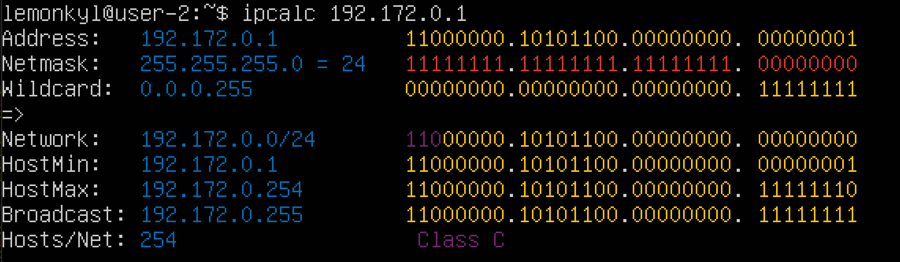
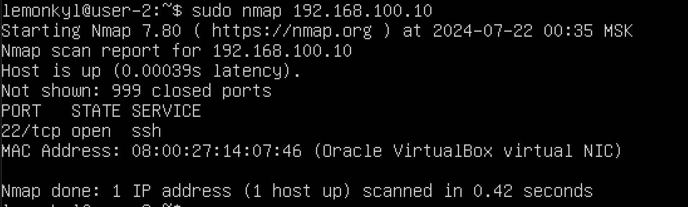
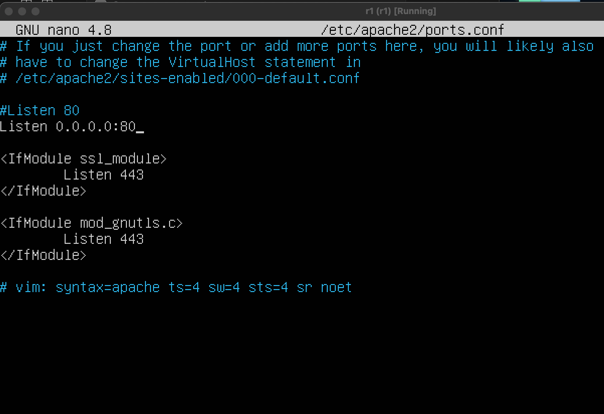
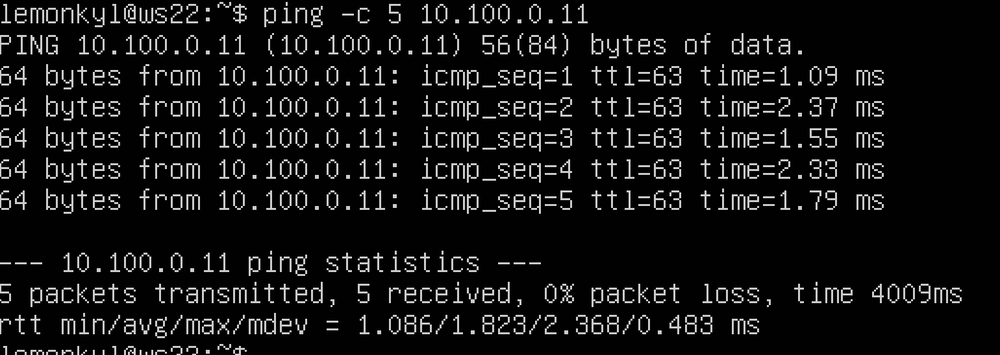
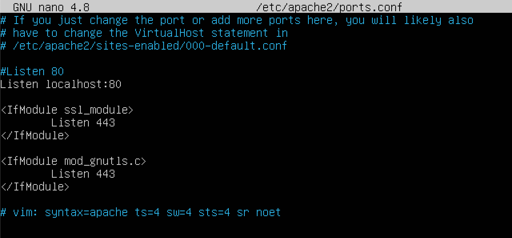

## Part 1. Инструмент ipcalc
+ Подними виртуальную машину (далее -- ws1).  

Включаем виртуальную машину и устанавливаем себе утилиту ipcalc.

ipcalc — это утилита, которая может выполнять простые манипуляции с адресами IPv4. Набор ipcalc без параметров предполагает справочный вывод с примерами.

pcalc применяется для:

проверки IP-адреса;  
показа широковещательного адреса;  
отображения имени хоста, определенного через DNS;  
отображения сетевого адреса или префикса.

Для установки утилиты ipcalc ыыодим команду `sudo apt install ipcalc`. После повторного ввода команды, видим, что все утилита установлена и не нуждается в обновлениях:

### 1.1. Сети и маски
#### Определи и запиши в отчёт:
1) Адрес сети 192.167.38.54/13.  

Для того, чтобы определить необходимую нам сеть, нужно использовать команду `ipcalc 192.167.38.54/13` (ipcalc + название сети).

2) Перевод маски 255.255.255.0 в префиксную и двоичную запись, /15 в обычную и двоичную, 11111111.11111111.11111111.11110000 в обычную и префиксную.  

Используем команду `ipcalc 192.167.38.54/255.255.255.0` и видим, что префиксная форма записи равна 24, а двоичная - 11111111.11111111.11111111.00000000.

Для /15 используем команду `ipcalc 192.167.38.54/15` и видим, что префиксная форма записи - 255.254.0.0, а двоичная - 11111111.1111111 0.00000000.00000000.

Для 11111111.11111111.11111111.11110000 используем команду `ipcalc 192.167.38.54/11111111.11111111.11111111.11110000` и видим, что префиксная форма записи - 28 (количество единичек), а обычная (вводим `ipcalc 192.167.38.54/28`) - 255.255.255.240.

3) Минимальный и максимальный хост в сети 12.167.38.4 при масках: /8, 11111111.11111111.00000000.00000000, 255.255.254.0 и /4.  

Хост - («владелец, принимающий гостей») — любое устройство, предоставляющее сервисы формата «клиент-сервер» в режиме сервера по каким-либо интерфейсам и уникально определённое на этих интерфейсах. В более широком смысле под хостом могут понимать любой компьютер, подключённый к локальной или глобальной сети. 

Маска /8 (команда `ipcalc 12.167.38.4/8`):  

+ максимальный хост (HostMax): 12.255.255.254
+ минимальный хост (HostMin): 12.0.0.1.  

Маска 11111111.11111111.00000000.00000000 (команда `ipcalc 12.167.38.4/16`):

+ максимальный хост (HostMax): 12.167.255.254.
+ минимальный хост (HostMin): 12.167.0.1.  

Маска 255.255.254.0 ( команда `ipcalc 12.167.38.4/255.255.254.0`):

+ максимальный хост (HostMax): 12.167.39.254.
+ минимальный хост (HostMin): 12.167.38.1.  

### 1.2. localhost
+ Определи и запиши в отчёт, можно ли обратиться к приложению, работающему на localhost, со следующими IP: 194.34.23.100, 127.0.0.2, 127.1.0.1, 128.0.0.1. 

Localhost, он же локальный хост — это специальное зарезервированное имя для частных IP-адресов. Его можно открыть на любом компьютере, и для этого не потребуется даже сетевая карта или подключение к интернету. Если сеть состоит из одного хоста, то его адрес будет таким: 127.0.0.1.

1) IP 194.34.23.100 (обратиться к локалхосту нельзя (подписи Loopback нет):

2) IP 127.0.0.2 (обращение возможно):  

3) IP 127.1.0.1 (обращение возможно):

4) IP 128.0.0.1 (обратиться к локалхосту нельзя (подписи Loopback нет):

### 1.3. Диапазоны и сегменты сетей
+ Определи и запиши в отчёт:

1) Какие из перечисленных IP можно использовать в качестве публичного, а какие только в качестве частных: 10.0.0.45, 134.43.0.2, 192.168.4.2, 172.20.250.4, 172.0.2.1, 192.172.0.1, 172.68.0.2, 172.16.255.255, 10.10.10.10, 192.169.168.1

Публичный IP адрес - называется IP адрес, который используется для выхода в Интернет. Частный IP адрес - адреса, используемые в локальных сетях (не может быть напрямую подключен к Интернету).

Публичные IP-адреса: 134.43.0.2, 172.0.2.1, 192.172.0.1, 172.68.0.2, 192.169.168.1.

Частные IP-адреса: 10.0.0.45, 192.168.4.2, 172.20.250.4, 172.16.255.255, 10.10.10.10 (присутствует надпись внизу `Privat internet`).

2) Какие из перечисленных IP адресов шлюза возможны у сети 10.10.0.0/18: 10.0.0.1, 10.10.0.2, 10.10.10.10, 10.10.100.1, 10.10.1.255.

Из всех перечисленных IP адресов шлюза выбранной сети возможны следующие: 10.10.0.2, 10.10.10.10, 10.10.1.255.

## Part 2. Статическая маршрутизация между двумя машинами

Устанавливаем все указанные в задании утилиты с помощью команды `sudo apt intall`. После чего закрываем виртуальную машину и клонируем её. В настройках заходим в сеть и `выбираем внутрення сеть`.

+ Подними две виртуальные машины (далее -- ws1 и ws2).
+ С помощью команды `ip a` посмотри существующие сетевые интерфейсы.

+ Опиши сетевой интерфейс, соответствующий внутренней сети, на обеих машинах и задать следующие адреса и маски: ws1 - 192.168.100.10, маска /16, ws2 - 172.24.116.8, маска /12.

С помощью следующей команды `netstat -nr` (-n - отбражение адресов в числовом виде, 
-r - отображение в виде таблицы) проверяем адреса машин:

Далее используем команду `etc/netplan/00-installer-config.yaml` (файл который нужно отредактировать на каждой машине, этот файл отвечает за настройку интерфейсов сети.) для каждой машины. На двух машинах данный файл выглядит одинаково:  

Далее вводим необходимые данные, указанные в задании:

После чего вводим команду `sudo netplan apply` на двух машинах и видим изменения:

Потом вводим команды `sudo netplan apply` и `netstat -nr`.

Перепроверяем настройки командой `ip a`:

### 2.1 Добавление статического маршрута вручную
+ Добавь статический маршрут от одной машины до другой и обратно при помощи команды вида ip r add. Вводим команды `sudo ip route add 172.24.116.8 dev enp0s3` и  `sudo ip route add 192.168.100.0 dev enp0s3`:

+ Пропингуй соединение между машинами (команда `ping -c 5 172.24.116.8` и `ping -c 5 192.168.100.10`(c - указывает количество пакетов):

### 2.2. Добавление статического маршрута с сохранением
+ Перезапусти машины.

+ Добавь статический маршрут от одной машины до другой с помощью файла /etc/netplan/00-installer-config.yaml.

Так как данные не сохранились, необходимо снова отредактировать файл `etc/netplan/00-installer-config.yaml`. Вводим команду и изменяем файлы, как указано на скринах:

Снова используем команду `sudo netplan apply` для сохранения настроек. 
+ Пропингуй соединение между машинами.

## Part 3. Утилита iperf3

### 3.1. Скорость соединения

+ Переведи и запиши в отчёт: 8 Mbps в MB/s, 100 MB/s в Kbps, 1 Gbps в Mbps.

1) 8 Mbps (мегабит в секуду) = 1 MB/s (мегабайт в секунду);  
2) 100 MB/s (мегабайт в секунду) = 800 000 Kbps (килобит в секунду);  
3) 1 Gbps (гигабит в секунду) = 1 000 Mbps (мегабит в секунду)

### 3.2. Утилита iperf3

+ Измерь скорость соединения между ws1 и ws2.

Закрываем обе машины, заходим в настройки и устанавливаем для второго адаптера в сети `NAT`. 

iperf3 — кроссплатформенная консольная клиент-серверная программа — генератор TCP и UDP трафика для тестирования пропускной способности в IP-сетях (поддерживает IPv4 и IPv6). С ее помощью довольно просто измерить максимальную пропускную способность сети между сервером и клиентом и провести нагрузочное тестирование канала связи. Поскольку утилита имеет как серверную часть так и клиентскую, надо рассматривать обе отдельно. Чтобы протестировать пропускную способность сети, вам нужно сначала подключиться к удаленной машине, которую вы будете использовать в качестве сервера.

Установку данной утилиты провела ещё во втором задании. 

Для установки и выхода в интернет может потребоваться обновление системы, которое можно сделать с помощью команды `sudo apt update & upgrade`.

Запускаем утилиту на ws1 в режиме сервер с флагом -s. Она будет ожидать пока не запустится этаже утилита на ws2 в режиме клиента `iperf3 -s`. На ws2 `iperf3 -c 192.168.100.10` и видим:

## Part 4. Сетевой экран
 ### 4.1. Утилита iptables

+ Создай файл /etc/firewall.sh, имитирующий фаерволл, на ws1 и ws2:

iptables — это утилита брандмауэра командной строки, которая использует цепочки политик для разрешения или блокировки трафика. Когда соединение пытается установиться в системе, iptables ищет правило в своем списке, чтобы сопоставить его. Если утилита не находит нужного правила, она прибегает к действию по умолчанию.

Создаем на обеих машинах файл /etc/firewall.sh с помощью команды `touch`.

Нужно добавить в файл подряд следующие правила:

1) На ws1 примени стратегию, когда в начале пишется запрещающее правило, а в конце пишется разрешающее правило (это касается пунктов 4 и 5).

2) На ws2 примени стратегию, когда в начале пишется разрешающее правило, а в конце пишется запрещающее правило (это касается пунктов 4 и 5).

3) Открой на машинах доступ для порта 22 (ssh) и порта 80 (http).

4) Запрети echo reply (машина не должна «пинговаться», т.е. должна быть блокировка на OUTPUT).

5) Разреши echo reply (машина должна «пинговаться»).

Для добавления в файл необходимых правил, описанных выше, открываем на обеих машинах файл через редактор (использую нано) и получается:
  

+ Запусти файлы на обеих машинах командами chmod +x /etc/firewall.sh и /etc/firewall.sh.

Запускаем файлы с помощью команд `sudo chmod +x /etc/firewall.sh` и `sudo bash /etc/firewall.sh`.

### 4.2. Утилита nmap

nmap - это очень популярный сканер сети, для исследования сети и аудита безопасности. Он имеет открытый исходный код, который может использоваться как в Windows, так и в Linux.

+ Командой ping найди машину, которая не «пингуется», после чего утилитой nmap покажи, что хост машины запущен.

Используем команду `ping -с 3 + IP-address`.
Вторая машина не пингуется:

Для того, чтобы это исправить, использую утилиту nmap (установку производила в самом начале проверки). Вводим на второй машине команду `sudo nmap + IP-адресс`.

Строчка `Host is up` существует, значит, всё хорошо. 

+ Сохрани дампы образов виртуальных машин.

Чтобы сохранить образы машин, закрываем обе машины и в настройках выбираем опции и снимки. Делаем новый снимок и сохраняем:

Дампы сохраняются в папку goinfree.

## Part 5. Статическая маршрутизация сети

+ Подними пять виртуальных машин (3 рабочие станции (ws11, ws21, ws22) и 2 роутера (r1, r2)).

Для этого клонируем от одной машины ещё 3 рабочие станции и 2 роутера (правая кнопка мыши - клонировать).

Заходим в настройки r1 и меняем 1 адаптер на NAT, второй - внутенная сеть с именем int_net_1, третий - внутенная сеть с именем int_net_2. Затем запускаем машину и меняем имя хоста на r1.
Перезагружаем машину.

То же самое проделываем и для второго роутера. Единственное - для второго и третьего адаптеров выбираем имена внутреней сети, как int_net_2 и int_net_3. И снова перезагружаем.

Для остальных машин:

1) ws11 (первый адаптер - nat, второй - внутренняя сеть под именем int_net_1);
2) ws21 и ws22 (первый адаптер - nat, второй - внутренняя сеть под именем int_net_3). 

### 5.1. Настройка адресов машин

+ Настрой конфигурации машин в etc/netplan/00-installer-config.yaml согласно сети на рисунке.

Вводим команду `ip a` на r1 и видим enp0s для 3, 8, 9:

На машинах ws их на один меньше:

С помощью команды `sudo nano /etc/netplan/00-installer-config.yaml` прописываем настройки сети:

+ Перезапусти сервис сети. Если ошибок нет, то командой ip -4 a проверь, что адрес машины задан верно. Также пропингуй ws22 с ws21. Аналогично пропингуй r1 с ws11.

Перезапускаем сервис сети на всех машинах, команда `sudo netplan apply`. Проверку адреса сети производим командой `ip -4 a` на всех машинах и видим:  
r1:

r2:

ws11:

ws21:

ws22:

Пингуем с помощью команды `ping -c 5 + адрес`.
1) ws22 с ws21:

2) r1 c ws11:

### 5.2. Включение переадресации IP-адресов
+ Для включения переадресации IP, выполни команду на роутерах `sysctl -w net.ipv4.ip_forward=1`.

+ Открой файл `/etc/sysctl.conf` и добавь в него следующую строку: `net.ipv4.ip_forward = 1`.
Для обоих роутеров запись раскомменченной строчки будет одинакова:

### 5.3. Установка маршрута по-умолчанию
+ Настрой маршрут по-умолчанию (шлюз) для рабочих станций. Для этого добавь default перед IP роутера в файле конфигураций.  

Для этого добавляем gateway4: ip роутера в файле конфигураций `etc/netplan/00-installer-config.yaml` на всех машинах: 
ws11:

Для вступления в силу сохранений применяем уже известную `sudo netplan apply`.  

+ Вызови ip r и покажи, что добавился маршрут в таблицу маршрутизации.
При вызове команды `ip r` видим, что изменения сохранились:
ws11:

ws21:

ws22:

+ Пропингуй с ws11 роутер r2 и покажи на r2, что пинг доходит. Для этого используй команду `tcpdump -tn -i eth0`. В это же время на ws11 вводим `ping -c 5 + адрес`.

### 5.4. Добавление статических маршрутов

+ Добавь в роутеры r1 и r2 статические маршруты в файле конфигураций. Пример для r1 маршрута в сетку 10.20.0.0/26:  
Для этого снова открываем файд /etc/netplan/00-installer-config.yaml:

+ Вызови ip r и покажи таблицы с маршрутами на обоих роутерах. 

+ Запусти команды на ws11: `ip r list 10.10.0.0/[маска сети]` и `ip r list 0.0.0.0/0`.

### 5.5. Построение списка маршрутизаторов
+ Запусти на r1 команду дампа: `tcpdump -tnv -i eth0`.

+ При помощи утилиты traceroute построй список маршрутизаторов на пути от ws11 до ws21.

Каждый пакет проходит на своем пути определенное количество узлов, пока достигнет своей цели. Причем, каждый пакет имеет свое время жизни. Это количество узлов, которые может пройти пакет перед тем, как он будет уничтожен. Этот параметр записывается в заголовке TTL, каждый маршрутизатор, через который будет проходить пакет уменьшает его на единицу. При TTL=0 пакет уничтожается, а отправителю отсылается сообщение Time Exceeded.

Команда traceroute linux использует UDP пакеты. Она отправляет пакет с TTL=1 и смотрит адрес ответившего узла, дальше TTL=2, TTL=3 и так пока не достигнет цели. Каждый раз отправляется по три пакета и для каждого из них измеряется время прохождения. Пакет отправляется на случайный порт, который, скорее всего, не занят. Когда утилита traceroute получает сообщение от целевого узла о том, что порт недоступен трассировка считается завершенной.

### 5.6. Использование протокола ICMP при маршрутизации

+ Запусти на r1 перехват сетевого трафика, проходящего через eth0 с помощью команды: `tcpdump -n -i eth0 icmp`.

+ Пропингуй с ws11 несуществующий IP (например, 10.30.0.111) с помощью команды:
`ping -c 1 10.30.0.111`.

+ Сохрани дампы образов виртуальных машин.

## Part 6. Динамическая настройка IP с помощью DHCP

Для начала необходимо установить  DHCP. Вводим sudo `apt-get install isc-dhcp-server`.

+ Для r2 настрой в файле /etc/dhcp/dhcpd.conf конфигурацию службы DHCP:

1) Укажи адрес маршрутизатора по-умолчанию, DNS-сервер и адрес внутренней сети. 

2) В файле resolv.conf пропиши nameserver 8.8.8.8.

В ws21 и ws22 сделаем протокол активным, снова открыв файл etc/netplan/00-installer-config.yaml вносим изменения на двух машинах:

Перезагружаем первую машину - `sudo systemctl reboot`.

+ Перезагрузи службу DHCP командой `systemctl restart isc-dhcp-server`. Машину ws21 перезагрузи при помощи reboot и через ip a покажи, что она получила адрес. Также пропингуй ws22 с ws21.

Пингуем:

+ Укажи MAC адрес у ws11, для этого в `etc/netplan/00-installer-config.yaml` надо добавить строки: `macaddress: 10:10:10:10:10:BA`, `dhcp4: true.`.

Выключаем машину. Заходим в сеть машины и прописываем адрес для второго адаптера.

+ Для r1 настрой аналогично r2, но сделай выдачу адресов с жесткой привязкой к MAC-адресу (ws11). Проведи аналогичные тесты.

+ Запроси с ws21 обновление ip адреса.

Запрашиваем обновление ip-адреса с помощью команды `sudo dhclient -v`:

Видим, что ip обновился:

Удаляем ip:

Чтобы обновить или освободить IP-адрес для конкретного интерфейса, например, eth0, необходимо ввести `sudo dhclient -r eth0` и `sudo dhclient eth0`:

+ Сохрани дампы образов виртуальных машин.

## Part 7. NAT

Восстановляем машины из части 5.

Устанавливаем apache2: `sudo apt install apache2`,
`sudo apt update`, `sudo apt upgrade -y`.

+ В файле /etc/apache2/ports.conf на ws22 и r1 измени строку Listen 80 на Listen 0.0.0.0:80, то есть сделай сервер Apache2 общедоступным.
В ws22 меняем данные, чтобы включить интернет:

Затем выполняем задание:

+ Запусти веб-сервер Apache командой `service apache2 start` на ws22 и r1.

+ Добавь в фаервол, созданный по аналогии с фаерволом из Части 4, на r2 следующие правила:

1) Удаление правил в таблице filter - iptables -F;
2) Удаление правил в таблице "NAT" - iptables -F -t nat;
3) Отбрасывать все маршрутизируемые пакеты - iptables --policy FORWARD DROP.

+ Запусти файл также, как в Части 4.

+ Проверь соединение между ws22 и r1 командой `ping`.

Как и должно, соединения нет.
+ Добавь в файл ещё одно правило:
4) Разрешить маршрутизацию всех пакетов протокола ICMP.

+ Запусти файл также, как в Части 4.

+ Проверь соединение между ws22 и r1 командой ping.

+ Добавь в файл ещё два правила:
5) Включи SNAT, а именно маскирование всех локальных ip из локальной сети, находящейся за r2 (по обозначениям из Части 5 - сеть 10.20.0.0).
6) Включи DNAT на 8080 порт машины r2 и добавить к веб-серверу Apache, запущенному на ws22, доступ извне сети.

+ Запусти файл также, как в Части 4.

+ Проверь соединение по TCP для SNAT: для этого с ws22 подключиться к серверу Apache на r1 командой:
`telnet [адрес] [порт]`.

+ Проверь соединение по TCP для DNAT: для этого с r1 подключиться к серверу Apache на ws22 командой `telnet` (обращаться по адресу r2 и порту 8080).

+ Сохрани дампы образов виртуальных машин.

## Part 8. Дополнительно. Знакомство с SSH Tunnels

Запускаем машины из пятой части.
Обновляем их и устанавливаем apache2.

+ Запусти на r2 фаервол с правилами из Части 7.

+ Запусти веб-сервер Apache на ws22 только на localhost (то есть в файле /etc/apache2/ports.conf измени строку Listen 80 на Listen localhost:80).

+ Воспользуйся Local TCP forwarding с ws21 до ws22, чтобы получить доступ к веб-серверу на ws22 с ws21.  

Сначала вводим команду `ps aux | grep sshd` (проверяем процессы):

Затем вводим команду  `sshd  10.20.0.10` на ws22:

После вводим с машины 21 команду `telnet`:

Проверяем соединения через `sshd  10.20.0.10` на ws22 и видим новое подключение:

Убиваем соединение:

+ Воспользуйся Remote TCP forwarding c ws11 до ws22, чтобы получить доступ к веб-серверу на ws22 с ws11.
+ Для проверки, сработало ли подключение в обоих предыдущих пунктах, перейди во второй терминал (например, клавишами Alt + F2) и выполни команду:
telnet 127.0.0.1 [локальный порт]

Используем все те же конманды, что использовали выше, но на других машинах:

+ Сохрани дампы образов виртуальных машин.

Сохраняем дампы с 8-ой части в виртуальной машине и завершаем проект.

## СПАСИБО ЗА ВНИМАНИЕ!

